# NovelSeek Ultra

> 一款基于 AI 的 Android 小说创作助手，由桌面端项目 [NovelSeek-Ultra-PC](https://github.com/QwenchC/NovelSeek-Ultra-PC) 迁移而来，现在两者已实现机制同步，备份格式与桌面端 NovelSeek-Ultra-PC 完全互通，可无损互导。

---

## 功能概览

### 📖 长篇小说
- 创建与管理多个长篇小说项目
- **副本（分卷）机制**：大纲生成副本，项目页副本列表可展开/收起；点开某个副本显示其下剧情弧线
  - 副本、弧线均支持 **AI 生成（可指定一次生成几个 + 自定义要求指令）** 与手动添加
  - 副本可重命名 / 调整序号 / 编辑描述；弧线可编辑、按序号快捷调序、规划章节
  - 旧版项目（仅有弧线、无副本）自动迁移并归入"副本1"
- 大纲保存支持选择性覆盖世界观、时间线、角色、副本等字段
- 逐章 AI 写作，自动注入上下文（前章摘要、角色信息、世界观）
- 章节生成页可在当前章节**前 / 后插入新章节**，后续章节序号自动顺延
- 章节封面头图批量生成（跳过已有图片）
- 宣传图 & 封面图 AI 生成

### 📄 短篇小说
- 创建与管理多个短篇小说项目
- AI 生成严格格式大纲（世界观 / 时间线 / 章节列表，无弧线）
- 从大纲一键导入空白章节
- 逐章 AI 写作，章节间自动衔接（前章摘要机制）

### 🧙 角色管理
- 每个项目独立的角色库
- 从 AI 生成大纲中批量导入角色
- **新建角色支持一句话 AI 快速生成**：输入一句描述即可自动填写姓名/性别/身份/性格/背景/动机/形象等全部字段；生成时注入大纲、世界观与境界体系，确保角色与小说契合，并自动匹配境界
- 角色信息（背景、外貌、性格等）自动注入章节生成

### 🌍 世界观 & 修炼体系
- 独立世界观信息管理
- 修炼体系（境界）编辑对话框
- 世界观信息注入大纲与章节生成

### 📤 导出
- 章节文本导出为 **PDF** 或纯文本

### 🕘 版本管理（全项目快照）
- 项目页「版本」入口，把**整个项目**（章节正文、大纲、世界观、角色、插图、宣传图等）打包成版本快照，类似 `git commit`
- 支持手动保存版本、AI 覆盖章节前自动备份；可查看历史、一键回退到任意版本（回退前自动备份，可再次撤销）
- 回退后自动清理失效的知识库向量，并标记需重建的章节，支持**仅重建变化章节**的增量重建

### 🤖 小说问答（AI 智能体）
- 项目页 / 章节生成页「问答」入口，用自然语言询问关于**当前版本**小说的任何问题（如"角色现在什么境界""A 和 B 是什么关系""目前发生了哪些事"）
- 混合检索：结构化数据（角色 / 境界 / 关系 / 事件 / 知识条目 / 摘要 / 章节列表）始终可用，配置本地知识库后额外检索正文片段
- AI 只依据检索到的资料作答、可标注章节号，对话按项目持久化保存，支持追问与流式输出

### ✨ 智能体（Agent）
- 底栏正中的醒目入口，一个**会使用工具的自主智能体**：用设置里的文本/图片/知识库引擎 + DuckDuckGo 联网搜索，像人一样操作整个软件
- 一句话可完整生成小说项目：建项目 → 境界/世界观 → 大纲 → 角色与立绘 → 封面 → 副本/弧线/章节规划 → 逐章生成；也能精准操作（改/删/移 副本·弧线·章节、润色、插章、改名、推文、矛盾审阅、版本管理等，60+ 工具）
- **链式执行流**自上而下可见；可随时**停止 / 继续 / 运行中插话**；智能体也会在需要时**反问**你
- **半自主**：不可逆/耗费操作默认逐步确认；可「始终允许」或锁定项目后开启**自动继续**
- **多会话**：可命名智能体、新建/切换/删除会话，各自独立保存
- **后台执行**：前台服务 + 通知，**息屏/切后台仍继续**，通知栏可一键停止
- 隐私：绝不输出 API 密钥等私密信息

### 🎧 听书
- 底栏独立「听书」入口，可收听任意短篇 / 长篇小说项目
- 语音引擎用 **微软 Edge 免费神经语音**（无需密钥），多种中文音色 + 语速可选
- **分段流式朗读**：章节按句切段，逐段合成并播放，并预取下一段使衔接连贯（切换音色/语速会即时重备下一段）
- 切换章节、章末自动续下一章、N 段进度滑块可拖动跳段；离开页面自动保存进度，重进恢复

### 📦 容器（AI 自演化知识库）
- 项目页 / 章节生成页「容器」入口，新建可按角色 / 按章节分块、或不分块的资料容器
- 勾选**按章更新**：每次保存最新章时，AI 在各分块当前值基础上演进出新条目（无变化则跳过），并记录触发的章节，形成属性进化链
- 勾选**影响章节生成 / 影响副本生成 / 影响剧情弧线生成**：容器最新值作为**软引导**注入对应的 AI 生成，避免前后矛盾，同时允许自然演进
- 容器信息（名称 / 各开关）可随时修改，类型创建后锁定
- 分块随角色 / 章节数量自动增减；值链新旧可见、最新值可手动修改；受版本管理影响，每个分支独立

### 🎨 图片生成引擎
- **Pollinations**（默认）：云端免费图片生成，无需本地环境
- **ComfyUI**：连接局域网内本地运行的 ComfyUI，使用 `z-image-turbo` 工作流，支持高质量本地推理
  - 设置中填写局域网 IP 地址（如 `http://192.168.1.100:8188`）
  - 内置连接测试按钮

### ⚙️ 设置
- 配置 AI 服务的 API Key 与 Base URL；各 API 配置区附带获取地址超链接
- 选择图片生成引擎：Pollinations（云端）或 ComfyUI（本地）
- 密钥本地加密存储（Android Keystore + `security-crypto`）
- **数据备份/恢复**：完整导出/导入全部内容——项目、章节正文与草稿、章节插图、大纲/世界观/时间线、角色、副本与弧线、容器、摘要/实体、小说问答记录等（向量索引可重建，故不入备份）

---

## 技术栈

| 层次 | 技术 |
|------|------|
| 语言 | Kotlin |
| UI | Jetpack Compose + Material 3 |
| 架构 | ViewModel + Repository（单模块） |
| 网络 | OkHttp 4 + SSE 流式输出 |
| 图片生成 | Pollinations API / ComfyUI（本地局域网） |
| 图片加载 | Coil Compose |
| 序列化 | Kotlinx Serialization JSON |
| 持久化 | DataStore Preferences + JSON 文件 |
| 安全 | AndroidX Security Crypto（EncryptedSharedPreferences） |
| PDF 导出 | PdfBox Android |
| 启动屏 | Android SplashScreen API (core-splashscreen 1.0.1) |
| 最低 SDK | API 24（Android 7.0） |
| 目标 SDK | API 36 |

---

## 快速开始

### 环境要求

- Android Studio Meerkat 或更新版本
- JDK 11（Android Studio 内置 JBR 即可）
- Android SDK 36

### 构建运行

```bash
git clone https://github.com/QwenchC/NovelSeek-Ultra.git
cd NovelSeek-Ultra
./gradlew assembleDebug
```

或在 Android Studio 中直接 **Run ▶**。

### 配置 API Key 与图片引擎

打开应用 → 右上角 **设置（⚙）** → 填写：

| 字段 | 说明 |
|------|------|
| API Base URL | AI 文本服务地址，例如 `  https://api.deepseek.com` |
| API Key | 对应模型平台服务的密钥 |
| 图片引擎 | `Pollinations`（云端）或 `ComfyUI`（本地） |
| ComfyUI 地址 | 仅 ComfyUI 模式需填，填局域网 IP，如 `http://192.168.1.100:8188` |

> **ComfyUI 须知**：手机与运行 ComfyUI 的电脑需在同一局域网。应用使用内置 `t2i-lumicreate.json` 工作流（z-image-turbo，不带 LoRA）。

---

## 使用教程

> 本教程覆盖 NovelSeek Ultra 全部核心功能，按实际操作流程排列。

---

### 目录

1. [界面总览](#1-界面总览)
2. [初次配置：设置 AI 服务](#2-初次配置设置-ai-服务)
3. [短篇小说：完整创作流程](#3-短篇小说完整创作流程)
4. [长篇小说：完整创作流程](#4-长篇小说完整创作流程)
5. [角色管理](#5-角色管理)
6. [修炼体系与境界](#6-修炼体系与境界)
7. [章节编辑器](#7-章节编辑器)
8. [插图生成](#8-插图生成)
9. [封面与宣传图](#9-封面与宣传图)
10. [版本管理](#10-版本管理)
11. [容器（AI 自演化知识库）](#11-容器ai-自演化知识库)
12. [小说问答](#12-小说问答)
13. [智能体（Agent）](#13-智能体agent)
14. [听书](#14-听书)
15. [导出](#15-导出)
16. [数据备份与恢复](#16-数据备份与恢复)

---

### 1. 界面总览

启动应用后会看到闪屏，随即进入主界面。底部导航栏共有 5 个入口：

| 图标 | 页面 | 说明 |
|------|------|------|
| 📖（左一） | 短篇小说 | 管理短篇项目 |
| 📚（左二） | 长篇小说 | 管理长篇项目（默认启动页） |
| 🤖（正中，大按钮） | 智能体 | 自主 AI 智能体 |
| 🎧（右二） | 听书 | 朗读任意项目章节 |
| ⚙️（右一） | 设置 | API 配置、备份等 |

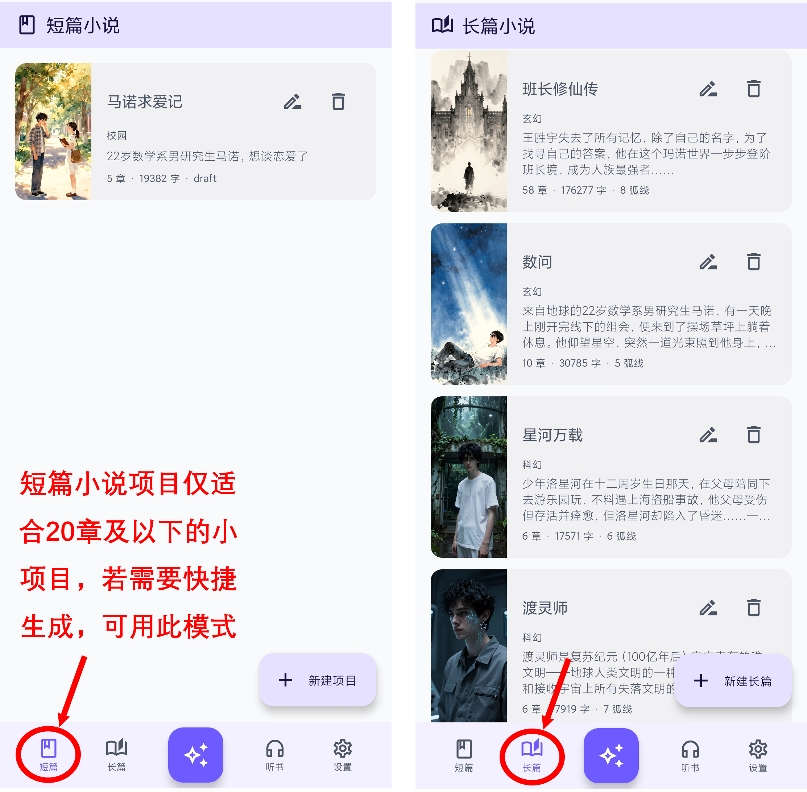

---

### 2. 初次配置：设置 AI 服务

首次使用需在**设置**页配置 AI 服务，否则所有 AI 功能不可用。

#### 2.1 进入设置

点击底部导航栏右侧 **⚙️ 设置**。

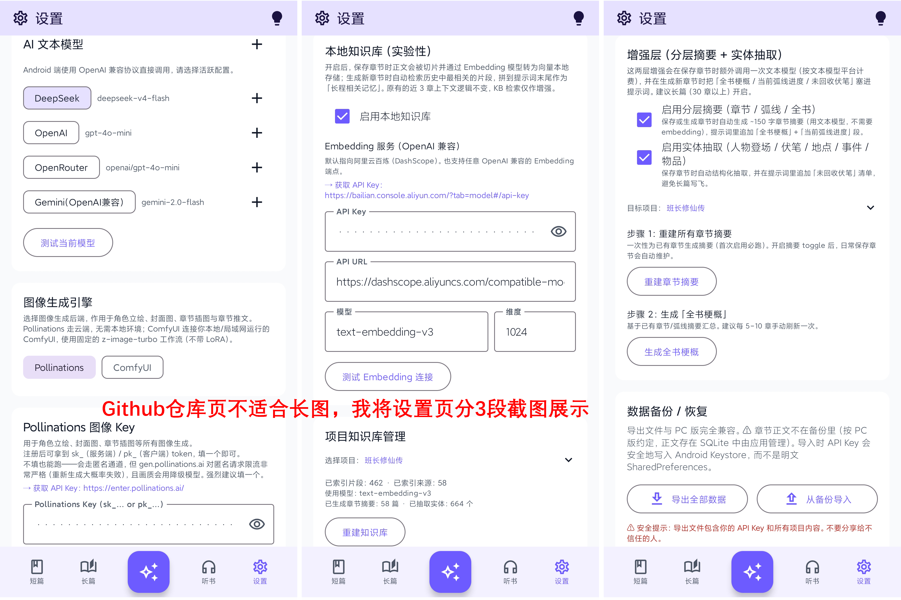

#### 2.2 配置文本模型（API）

在**文本模型配置**区块，点击 **「+ 添加」** 新建 API 配置：

- **API Base URL**：AI 文本服务地址（例如 `https://api.deepseek.com`）
- **API Key**：服务密钥（DeepSeek密钥获取地址`https://platform.deepseek.com/api_keys`）
- **模型名称**：填写你使用的模型 ID

填写后点击**测试连接**，出现绿色成功提示则配置正确。

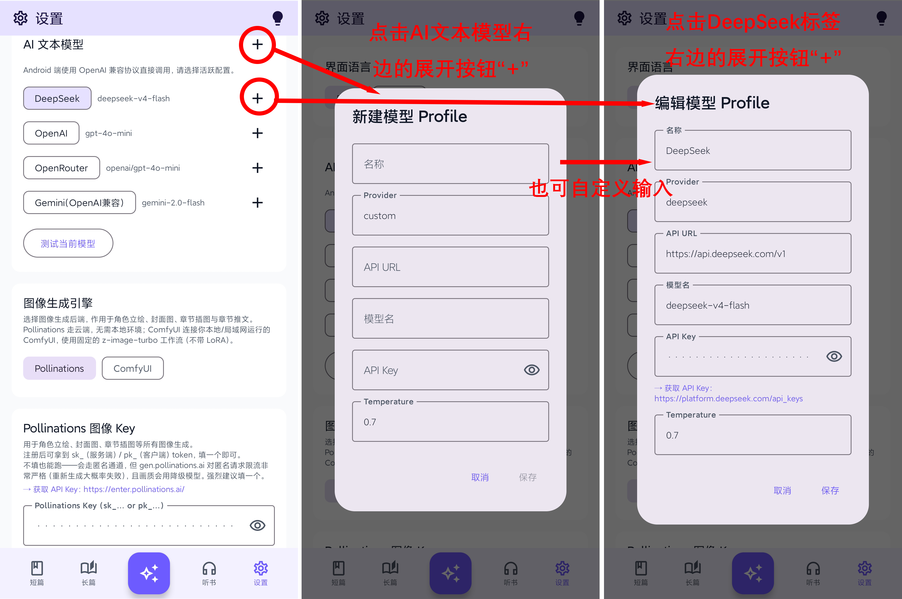

#### 2.3 （可选）配置 Embedding 服务（API）

在**本地知识库（实验性）**区块，点击 **「启用本地知识库」** 启动本地知识库：

- **API Base URL**：Embedding 服务地址（例如阿里云百炼 `https://bailian.console.aliyun.com/cn-beijing?tab=model#/api-key`）
- **API Key**：服务密钥（例如阿里云百炼 `https://dashscope.aliyuncs.com/compatible-mode/v1`）
- **模型名称**：填写你使用的模型 ID（例如阿里云百炼的text-embedding-v3）
- **维度**：默认1024

填写后点击**测试连接**，出现蓝色成功提示则配置正确。

#### 2.4 配置图片生成引擎

在**图片生成引擎**区块选择：

- **Pollinations**：云端免费，[但最好创建密钥](https://enter.pollinations.ai/#keys)，否则默认采用旧版文生图，质量较低
- **ComfyUI**：连接本地局域网 ComfyUI（适合有本地 GPU 的用户，且部署了"./workflows/t2i-lumicreate.json"的工作流并运行通过）
  - 填写局域网 IP，如 `http://192.168.1.100:8188`
  - 点击**测试 ComfyUI 连接**确认可达

> ⚠️ 使用 ComfyUI 时，手机与运行 ComfyUI 的电脑必须在同一 Wi-Fi 网络下。

---

### 3. （**仅用于20章以下项目，建议直接跳过此段看长篇小说项目介绍**）短篇小说：完整创作流程

短篇小说适合创作结构完整、篇幅较短的故事（5–20 章）。

#### 3.1 新建项目

在**短篇小说**页，点击右下角 **「＋ 新建项目」**：

- 填写**项目名称**（必填）、类型、简介
- 点击**创建**，自动进入项目页

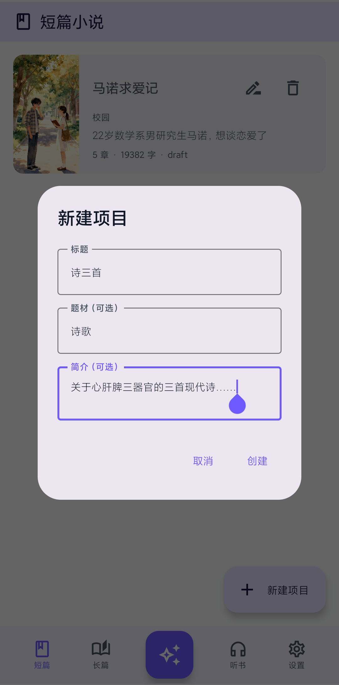

#### 3.2 生成大纲

在项目页点击 **「大纲」** 按钮，进入大纲页面。

**AI 生成流程：**

1. 填写**世界观描述**（世界背景、核心设定）
2. 填写**时间线**（故事发生的时间背景）
3. 填写**额外要求**（风格、禁忌内容等，可留空）
4. 选择**章节数量**（拖动滑块）
5. 点击 **「生成大纲」**，等待 AI 流式输出

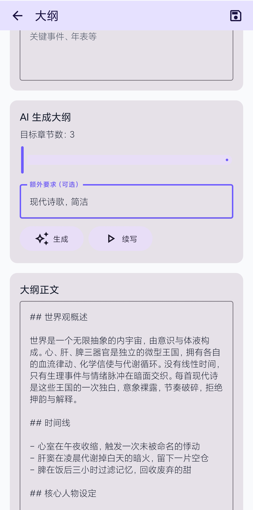

**大纲格式说明（AI 输出）：**
```
## 世界观
...

## 时间线
...

## 章节大纲
### 章节标题A
情节：...
关键场景：...

### 章节标题B
...
```

#### 3.3 保存大纲

AI 输出完成后，点击 **「保存大纲」**，弹出保存选项：

- 勾选需要覆盖的字段：**世界观**、**时间线**、**章节列表**（已有内容时会提示冲突）
- 点击**确认保存**

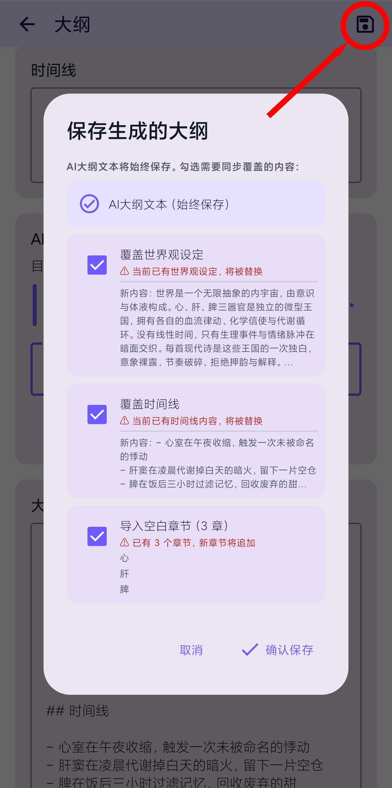

#### 3.4 从大纲导入章节

回到项目页，在**章节列表**标题右侧点击 **「从大纲导入」**：

- 弹窗展示从大纲中解析出的章节列表
- 确认后一键创建全部空白章节，顺序与大纲一致

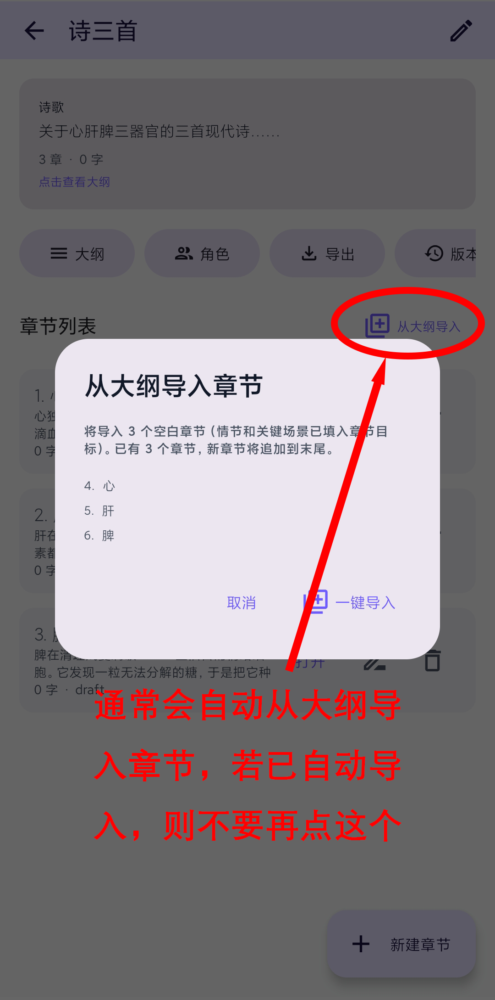

#### 3.5 逐章生成内容

点击章节卡片，进入**章节编辑器**。在编辑器中：

1. 上方**规划区**显示该章的目标、冲突（来自大纲）
2. 点击 **「✨ 生成」** 按钮，AI 自动注入上下文（前章摘要、角色信息、世界观）并生成
3. 生成内容出现在**正文**，可直接编辑修改
4. 满意后复制或直接作为最终稿保存

重复此步骤，逐章完成全文。

---

### 4. 长篇小说：完整创作流程

长篇小说支持**副本（分卷）+ 剧情弧线**的层级结构，适合 20 章以上的连载作品。

#### 4.1 新建项目

在**长篇小说**页，点击 **「＋ 新建长篇」**，流程与短篇相同。

#### 4.2 生成大纲

进入项目 → **「大纲」**，建议在**AI 生成大纲**栏可输入额外要求，也可不输入，世界观和时间线也可不输入，直接点击**生成**按钮，长篇大纲文本生成并额外输出**副本（分卷）结构**。

保存时可选择覆盖：世界观、时间线、角色、**副本与弧线**。

#### 4.3 管理副本与剧情弧线

项目页中间区域显示**副本列表**（可展开/收起）：

- **每个副本**下方列出其所属的剧情弧线
- 点击副本名称旁的 **✏️** 可重命名或编辑描述
- 点击 **「＋ 添加弧线」** 手动新增剧情弧线
- 点击副本旁 **「AI 生成」** 可批量 AI 生成弧线（可指定数量和要求）

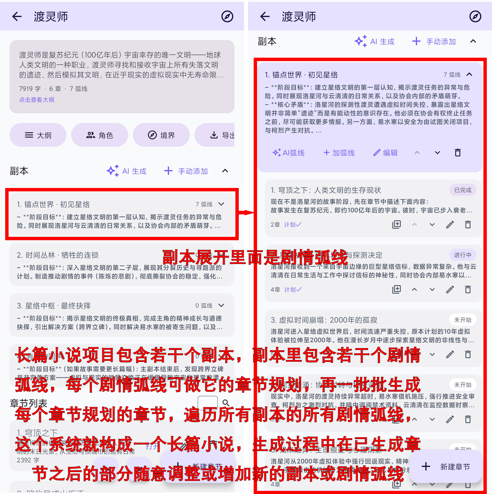

#### 4.4 快捷调整副本和弧线顺序

每个副本和每条弧线卡片下端有 **↑↓ 按序号调序** 快捷按钮，点击即可调整在副本内的先后顺序，后续章节序号自动顺延。

#### 4.5 章节生成（插入机制）

长篇章节生成与短篇相同，但额外支持：

- 在当前章节**前**或**后**插入新章节（**章节生成页面**的编辑器上方的**规划**框内的按钮**插入章节**操作）
- 插入后所有后续章节序号自动+1

---

### 5. 角色管理

每个项目有独立的角色库，点击项目页的 **「角色」** 按钮进入。也**可在大纲生成前在此处输入角色信息**，大纲文本中的角色信息会依据这里的角色信息生成。

#### 5.1 从大纲导入角色

点击顶栏右侧 **👤＋（从大纲导入）** 图标：

- 应用自动解析当前大纲中的角色信息
- 勾选需要导入的角色（已存在的默认跳过）
- 点击**导入**，角色信息批量写入角色库

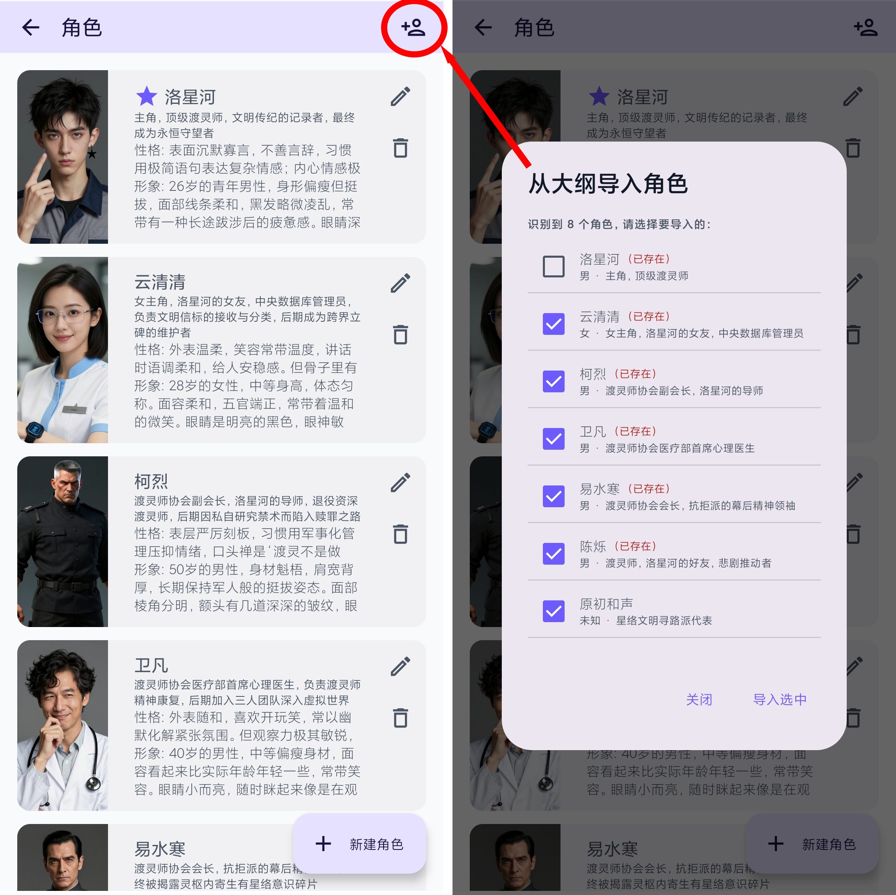

#### 5.2 手动新建 / AI 快速生成角色

点击右下角 **「＋ 新建角色」**，弹出角色编辑框：

- **输入一句描述**（如"一个冷酷的剑客，擅长暗器，曾是朝廷杀手"）后点击 **「AI 生成」**
- AI 自动填写：姓名、性别、身份、性格、背景故事、动机、外貌等全部字段
- 生成时自动参考当前大纲与境界体系，确保与小说设定一致
- 可手动修改任何字段后点击**保存**

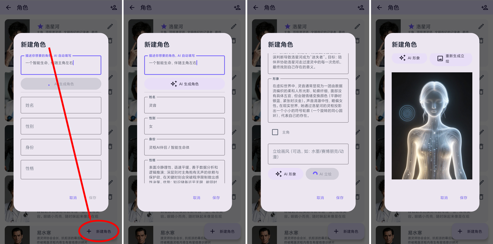

#### 5.3 角色头像生成

在角色编辑框中，点击右上角的编辑按钮打开**编辑角色**窗口，在**形象**栏输入信息（往往已由AI生成）， 可选输入立绘画风，点击**「AI 形象」** 由图片引擎根据角色描述生成立绘。

---

### 6. 修炼体系与境界

仙侠/玄幻类作品可使用**修炼体系**功能管理境界层级，进入方式：

- **长篇项目页**：点击顶栏右侧的 🗺️ 图标 → **境界信息**（不能编辑）
- **项目页工具栏**（一行可横向滑动的按钮）：找到 **「修炼」** 按钮 → **修炼体系管理**（可编辑）

#### 6.1 添加境界

在**项目页工具栏**打开**修炼体系管理**，修炼体系页，在顶部输入框填写境界名称与描述，点击 **「添加」**。

可在每个境界下添加子境界（如：炼气期 → 炼气一层、炼气二层……）。

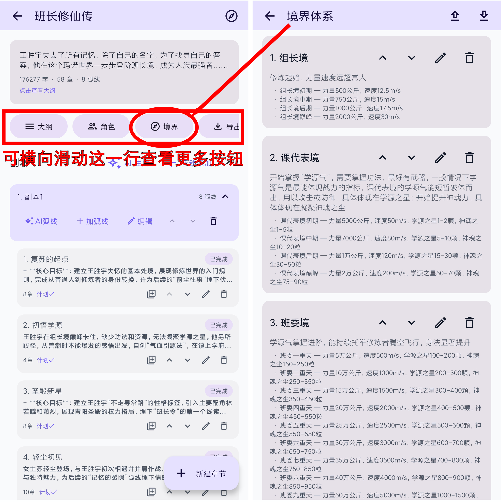

#### 6.2 为角色分配境界

点击顶栏 🗺️ 图标 → 弹出**境界信息对话框** → 切换到**角色境界** Tab：

- 展开每个角色，从列表中点击境界名称即可分配
- 也可同时指定子境界（如"筑基期·中期"）
- 境界信息会自动注入章节生成的上下文中

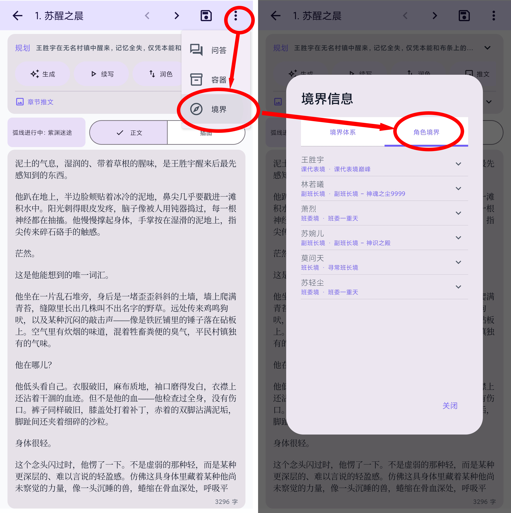

---

### 7. 章节编辑器

章节编辑器是写作的核心页面，有两个 Tab：

| Tab | 功能 |
|-----|------|
| 最终稿 | 定稿版本，用于导出 |
| 插图 | 为段落锚定 AI 生成插图 | 

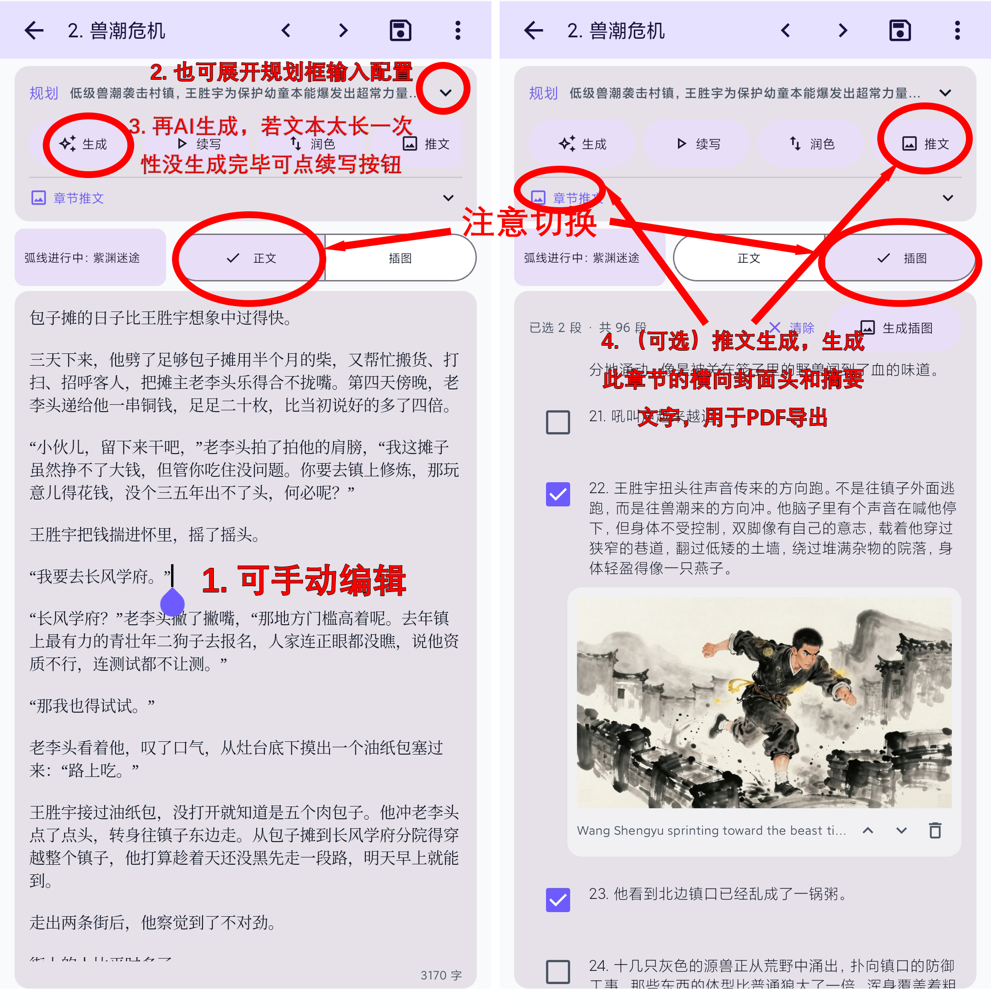

#### 7.1 AI 生成章节

点击 **「✨ 生成本章」**，AI 自动注入：

- 大纲目标与冲突（来自章节规划）
- 前 3 章摘要（越近越详细）
- 所有角色信息（主角尤其详细）
- 世界观与时间线
- 当前境界信息（如有）
- 容器最新值（如启用了"影响章节生成"的容器）
- 设置页的本地知识库的索引片段 + 章节摘要 + 全书梗概（如有）

生成内容实时流式显示在**草稿区**。

#### 7.2 AI 润色 / 改写选段

目前仅在PC端实现，在草稿区**长按并选中**一段文字，点击浮现的 **「改写」** 按钮，AI 对选中段落进行润色重写，结果替换原文。

#### 7.3 插入新章节

在章节生成页面编辑器上方的**规划**框，里面有一行按钮，点击 **插入章节** 可在当前章节前/后插入空白章节，其后所有章节序号自动顺延。

---

### 8. 插图生成

在编辑器切换到**插图 Tab**：

1. 点击任意段落将其**选中**（可随意勾选，可勾选不相邻的段落）
2. 点击 **「🎨 生成插图」** 按钮
3. 在弹出的配置框中设置图片宽高、风格关键词
4. 点击**生成**，图片出现后自动锚定到该段落

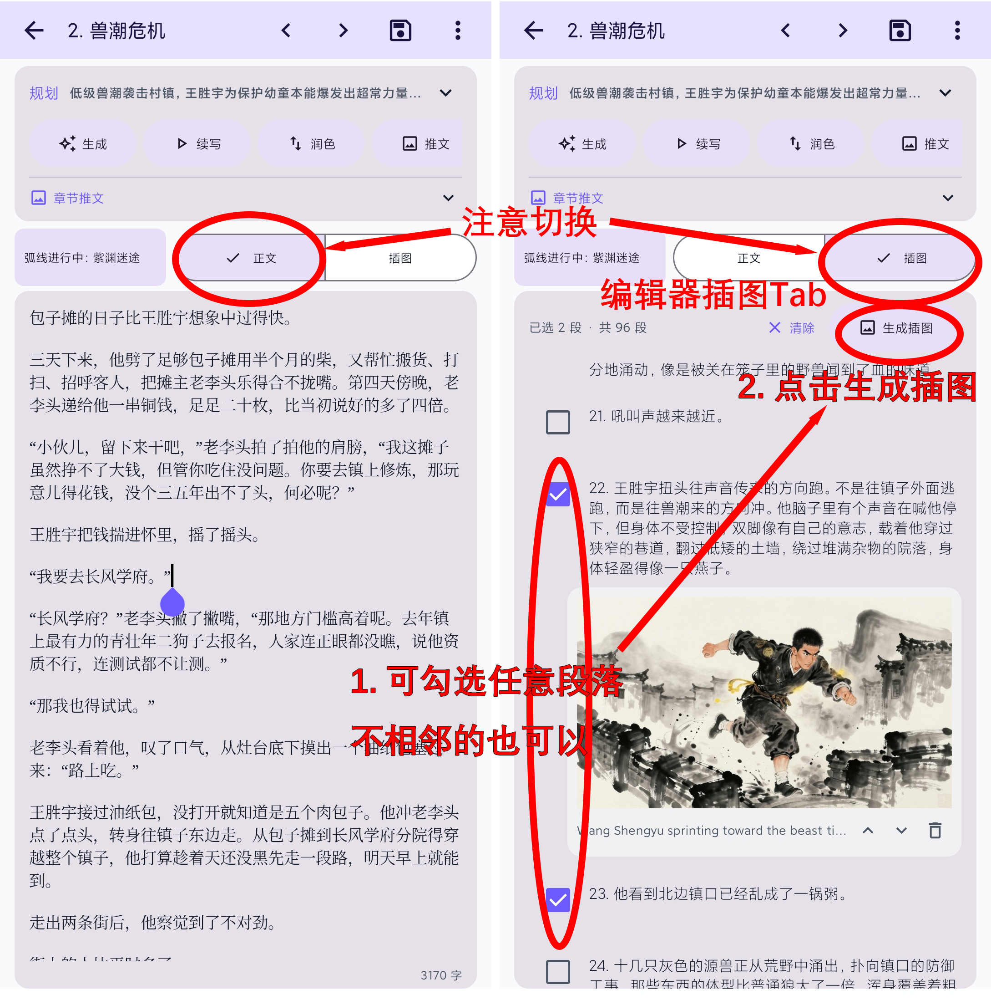

---

### 9. 封面与宣传图

在项目页工具栏（短篇/长篇通用）：

- **「封面」** → 管理项目封面图，支持多张轮播，可设为默认封面
- **「批量推文」** → 批量生成各章节的封面头图（已有图片的章节自动跳过）

#### 生成封面

进入封面管理，在底部配置区：

1. 填写**图片模型**（如 `zimage`）
2. 填写**风格描述**（如 "中国水墨，古风，高饱和"）
3. 选择**角色一致性**（可多选角色，将其外貌描述注入 Prompt）
4. 调整**宽高**
5. 点击 **「生成」**

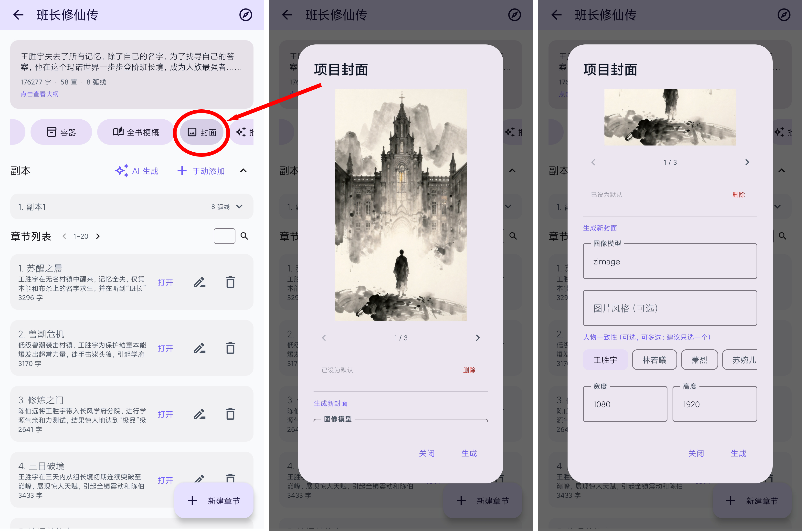

---

### 10. 版本管理

**版本管理**相当于小说项目的 Git 快照，将当前所有内容打包保存。

进入方式：项目页工具栏 → **「版本」**。

#### 10.1 保存版本

点击 **「保存当前版本」**，输入版本备注（如"第一卷完成"）后确认，系统打包全部数据（章节正文/草稿、大纲、角色、插图、弧线、容器等）。

> AI 生成章节前会**自动备份**，无需手动触发。

#### 10.2 回退版本

在版本列表中，点击任意历史版本 → **「回退到此版本」**：

- 系统在回退前先自动保存当前状态（可再次撤销）
- 回退完成后自动清理知识库中失效的向量
- 标记需要重建的章节，支持**仅重建变化章节**的增量重建

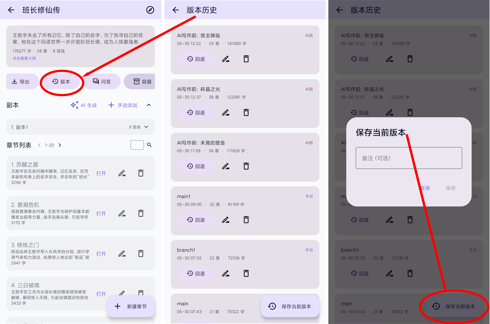

---

### 11. 容器（AI 自演化知识库）

**容器**是 NovelSeek Ultra 独有的功能——随着故事推进自动演化的知识条目，防止前后矛盾。

进入方式：项目页工具栏 → **「容器」**，或章节编辑器顶栏溢出菜单 → **「容器」**。

#### 11.1 新建容器

点击 **「＋ 新建容器」**，选择容器类型：

| 类型 | 说明 |
|------|------|
| 按角色分块 | 每个角色一个条目，追踪角色状态 |
| 按章节分块 | 每章一个条目，追踪情节发展 |
| 不分块 | 全局单一条目，适合追踪物品/设定等 |

#### 11.2 配置容器开关

| 开关 | 效果 |
|------|------|
| 按章更新 | 每次保存最新章时，AI 自动演进容器值 |
| 影响章节生成 | 容器最新值作为软引导注入章节生成 |
| 影响副本生成 | 容器值注入副本/弧线 AI 生成 |

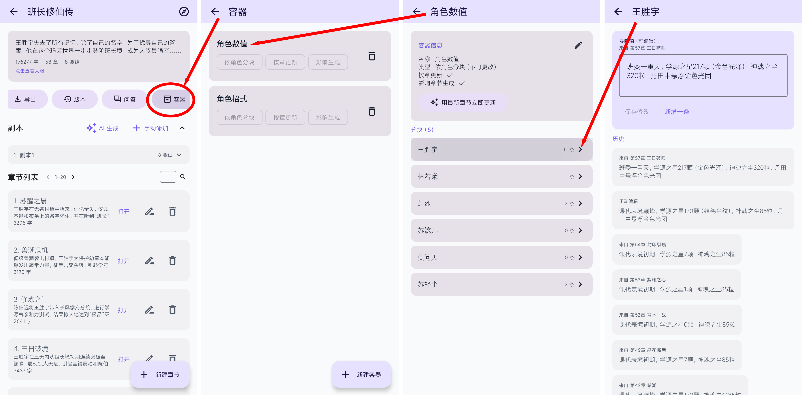

---

### 12. 小说问答

用自然语言向 AI 询问关于当前小说的任何问题。

进入方式：项目页工具栏 → **「问答」**，或章节编辑器顶栏溢出菜单 → **「问答」**。

**示例问题：**
- "陈风现在是什么境界？"
- "A 和 B 之间发生了什么事？"
- "目前哪些伏笔还没有被收回？"
- "第五章之后发生了什么大事？"

AI 基于当前版本的角色数据、境界信息、章节摘要等混合检索作答，并标注信息来源的章节编号，对话按项目保存，支持追问。

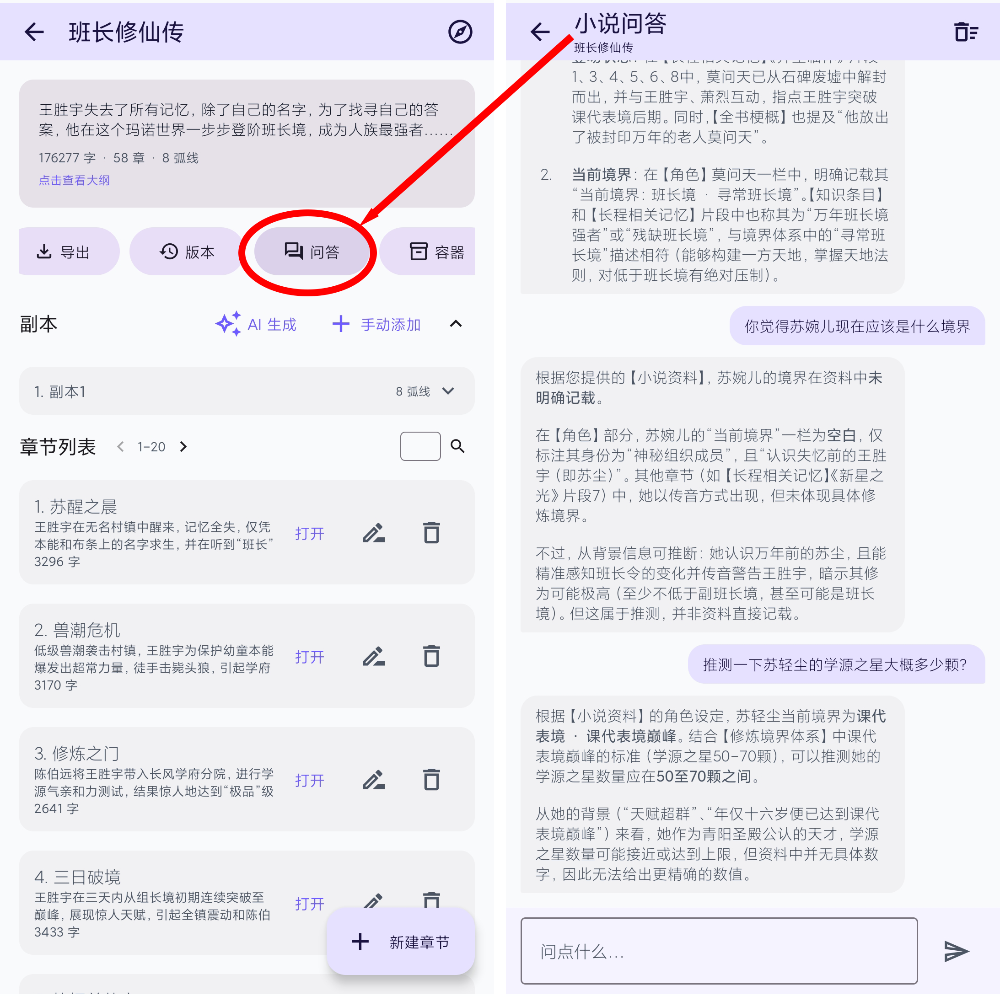

---

### 13. 智能体（Agent）

**智能体**是 NovelSeek Ultra 的旗舰功能——一个能像人一样操作全软件的自主 AI 助手。

点击底部导航栏**正中央**的 🤖 大按钮进入。

#### 13.1 一句话完成整本小说

在输入框输入你的需求，例如：

> "帮我写一部三卷十五章的东方玄幻小说，主角是剑修，带点悲剧色彩。"

智能体将自动执行：
建项目 → 设定境界体系 → 生成世界观 → 生成大纲 → 批量导入角色并生成立绘 → 生成封面 → 规划副本与弧线 → 逐章生成正文

整个过程在**执行流**中实时可见，每一步都有说明。


#### 13.2 控制执行

- **停止**：随时中断当前任务
- **继续**：中断后可恢复执行
- **插话**：运行中可发送新消息调整方向
- **反问**：智能体需要你决策时会暂停并提问

#### 13.3 半自主模式

敏感操作（如删除章节、回退版本）默认需要逐步确认。可在对话中说 **「始终允许」** 或锁定项目后开启**自动继续**，让智能体全程自主执行。

#### 13.4 后台运行

切到后台或息屏后，智能体继续运行（前台服务）。通知栏显示进度，可一键停止。

#### 13.5 多会话管理

点击顶部会话名称，可新建、重命名、切换或删除会话，各会话独立保存历史。

---

### 14. 听书

在底部导航栏点击 🎧 **听书** 进入。

1. 选择项目（短篇或长篇均可）
2. 选择要朗读的章节
3. 在顶部选择**音色**（多种中文神经语音）和**语速**
4. 点击 ▶ 播放

**功能特点：**
- 使用微软 Edge 免费神经语音，无需付费
- 分段流式合成，边生成边播放，衔接流畅
- 进度滑块可拖动跳段
- 章末自动播放下一章
- 离开页面自动保存进度，重进后从断点恢复

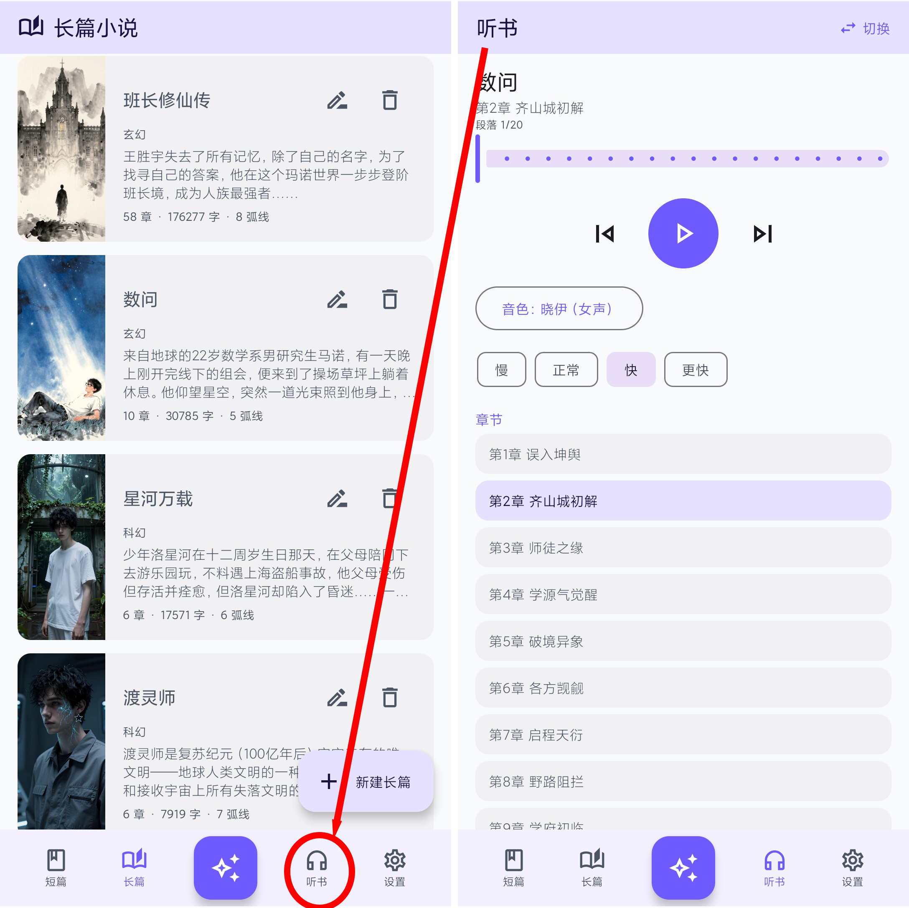

---

### 15. 导出

项目页工具栏 → **「导出」**，或章节编辑器内直接导出。

#### 支持格式

| 格式 | 特点 |
|------|------|
| TXT | 纯文本，兼容性最强 |
| Markdown | 保留标题层级结构 |
| PDF | 富文本排版，支持封面、目录、插图、章节推文图 |

#### PDF 导出选项

- ☑ 包含封面图
- ☑ 包含目录（可点击跳转）
- ☑ 包含章节头图（推文图）
- ☑ 包含段落插图
- ☑ 优先使用最终稿（否则用草稿）


---

### 16. 数据备份与恢复

设置页 → **「数据备份」** 区块。

#### 16.1 导出备份

点击 **「导出备份」**，系统生成包含全部项目数据的 JSON 文件（时间戳命名），保存到你指定的位置。

备份内容包括：项目信息、章节正文与草稿、插图、大纲/世界观/时间线、角色、副本与弧线、容器、摘要/实体、小说问答记录。

> ⚠️ API 密钥存储在 Android Keystore 中，**不会**出现在备份文件里，需要在新设备手动重新配置。

#### 16.2 导入备份（换机恢复）

点击 **「导入备份」** → 选择备份 JSON 文件 → 确认导入，所有项目和内容恢复到新设备。

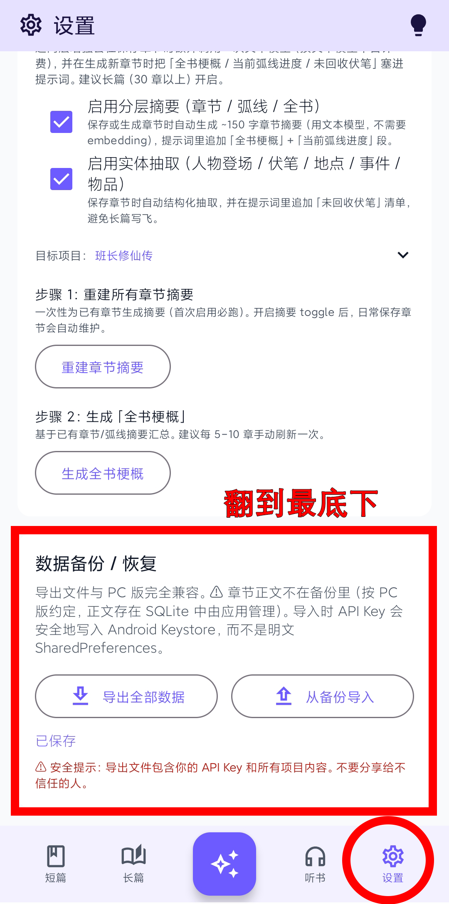

---

## 项目结构

```
app/src/main/java/com/example/novelseek_ultra/
├── MainActivity.kt              # 入口，安装 SplashScreen
├── data/
│   ├── model/                   # 数据模型（Domain, Backup, Kb）
│   ├── ai/                      # AI 服务（AiService, Prompts, KbService）
│   ├── export/                  # PDF / 文本导出
│   ├── AppRepository.kt         # 数据持久化
│   └── SecureStore.kt           # 加密存储
└── ui/
    ├── AppNavigation.kt          # 导航图
    ├── AppViewModel.kt           # 全局 ViewModel
    └── screens/                  # 各功能页面
        ├── HomeScreen.kt
        ├── LongNovelsHomeScreen.kt
        ├── LongNovelScreen.kt
        ├── ProjectScreen.kt       # 短篇小说项目页
        ├── OutlineScreen.kt       # 大纲生成（长/短篇通用）
        ├── CharactersScreen.kt
        ├── EditorScreen.kt
        ├── ExportScreen.kt
        ├── SettingsScreen.kt
        ├── CultivationScreen.kt
        └── RealmInfoDialog.kt
```

---

## 版本历史

### v1.5.0
- 新增 **智能体（Agent）**：底栏中心入口，会使用工具的自主智能体，能像人一样操作全软件（60+ 工具：建项目/境界/大纲/角色/立绘/封面/副本/弧线/章节规划/逐章生成，及增删改移、润色、插章、推文、矛盾审阅、容器、版本管理、设置等）
  - 链式执行流、可中断/继续/运行中插话、AI 可反问；长任务流式输出
  - 半自主：敏感操作逐步确认，可「始终允许」/锁定项目后自动继续
  - 多会话（可命名、切换）、**后台息屏执行**（前台服务+通知）、DuckDuckGo 联网搜索
  - 隐私保护：绝不输出 API 密钥等敏感信息
- 默认启动页改为**长篇小说项目列表**

### v1.4.0
- 新增 **副本（分卷）机制**：长篇大纲改为生成副本，副本内含剧情弧线；副本/弧线均支持 AI 生成（可选数量 + 要求指令）与手动管理；旧项目自动迁移到"副本1"；受版本管理隔离
- 容器新增 **影响副本生成 / 影响剧情弧线生成** 开关，容器信息支持修改（类型仍锁定）
- 剧情弧线状态精简为 未开始 / 进行中 / 已完成；新增**按序号快捷调序**
- **修复数据备份不完整**：现在完整导出/导入章节正文与草稿、插图、副本、摘要/实体、小说问答等（此前换设备恢复会丢失正文）
- **修复页面与底栏衔接**：消除嵌套 Scaffold 重复计算系统栏 inset 导致的竖屏空隙 / 横屏遮挡
- 设置页各 API 配置区增加获取地址超链接，并修正 Pollinations 链接为 `https://enter.pollinations.ai/`

### v1.3.1
- 项目「重命名」升级为「编辑项目」：可编辑项目简介并一键复制
- 项目详情页简介改为限行预览（最多 3 行 + 省略号），不再撑大卡片
- 容器信息（名称 / 按章更新 / 影响生成）支持修改，容器类型仍锁定

### v1.3.0
- 新增 **听书**：底栏听书入口，微软 Edge 免费神经语音，分段流式朗读 + 预取、进度滑块、断点续听
- 新增 **容器（AI 自演化知识库）**：按角色 / 按章节 / 不分块；可按章自动更新、软引导影响生成，受版本管理隔离
- 章节生成页顶栏精简：问答 / 容器 / 境界合并为溢出菜单

### v1.2.0
- 新增 **版本管理**：全项目快照、历史回退、知识库失效增量重建
- 新增 **小说问答 AI 智能体**：基于当前版本的混合检索问答，按项目保存会话
- 新增 **角色 AI 快速生成**：一句话描述自动生成契合小说设定的完整角色
- 新增 **插入新章节**：章节生成页可在当前章前 / 后插入新章节

### v1.1.0
- 新增 **ComfyUI 图片生成引擎**：可在设置中切换 Pollinations / ComfyUI
- ComfyUI 连接测试、局域网地址配置
- 图片自动压缩（ComfyUI 返回大尺寸 PNG，写入状态前自动 JPEG 压缩）

### v1.0.0
- 从 NovelSeek-Pro-PC 完整迁移至 Android
- 长/短篇小说 AI 大纲生成与章节写作
- 角色管理、世界观编辑、修炼体系
- 封面 & 宣传图 AI 生成
- 章节封面头图批量生成
- PDF 导出
- Android SplashScreen 启动画面

---

## License

MIT © 2026 QwenchC
