## 使用教程

> 本教程覆盖 NovelSeek Ultra 全部核心功能，按实际操作流程排列。

---

### 目录

1. [界面总览](#1-界面总览)
2. [初次配置：设置 AI 服务](#2-初次配置设置-ai-服务)
3. [短篇小说：完整创作流程](#3-短篇小说完整创作流程)
4. [长篇小说：完整创作流程](#4-长篇小说完整创作流程)
5. [角色管理](#5-角色管理)
6. [修炼体系与境界](#6-修炼体系与境界)
7. [章节编辑器](#7-章节编辑器)
8. [插图生成](#8-插图生成)
9. [封面与宣传图](#9-封面与宣传图)
10. [版本管理](#10-版本管理)
11. [容器（AI 自演化知识库）](#11-容器ai-自演化知识库)
12. [小说问答](#12-小说问答)
13. [智能体（Agent）](#13-智能体agent)
14. [听书](#14-听书)
15. [导出](#15-导出)
16. [数据备份与恢复](#16-数据备份与恢复)

---

### 1. 界面总览

启动应用后会看到闪屏，随即进入主界面。底部导航栏共有 5 个入口：

| 图标 | 页面 | 说明 |
|------|------|------|
| 📖（左一） | 短篇小说 | 管理短篇项目 |
| 📚（左二） | 长篇小说 | 管理长篇项目（默认启动页） |
| 🤖（正中，大按钮） | 智能体 | 自主 AI 智能体 |
| 🎧（右二） | 听书 | 朗读任意项目章节 |
| ⚙️（右一） | 设置 | API 配置、备份等 |


---

### 2. 初次配置：设置 AI 服务

首次使用需在**设置**页配置 AI 服务，否则所有 AI 功能不可用。

#### 2.1 进入设置

点击底部导航栏右侧 **⚙️ 设置**。

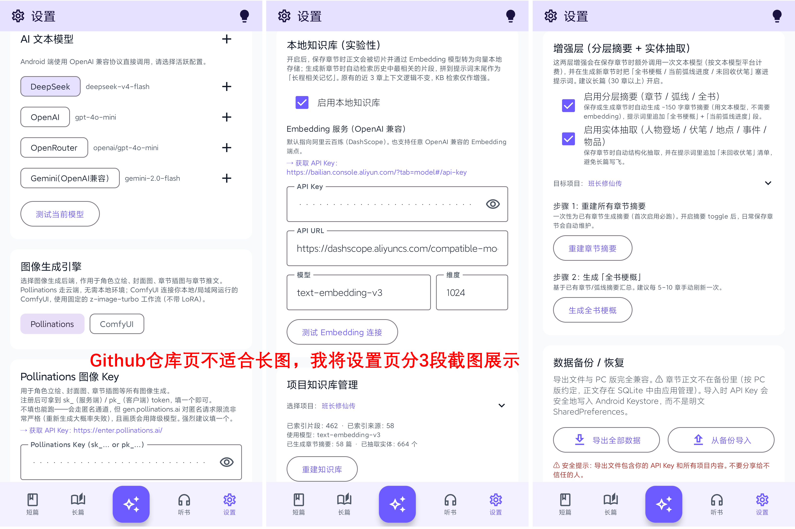

#### 2.2 配置文本模型（API）

在**文本模型配置**区块，点击 **「+ 添加」** 新建 API 配置：

- **API Base URL**：AI 文本服务地址（例如 `https://api.deepseek.com`）
- **API Key**：服务密钥（DeepSeek密钥获取地址`https://platform.deepseek.com/api_keys`）
- **模型名称**：填写你使用的模型 ID

填写后点击**测试连接**，出现绿色成功提示则配置正确。

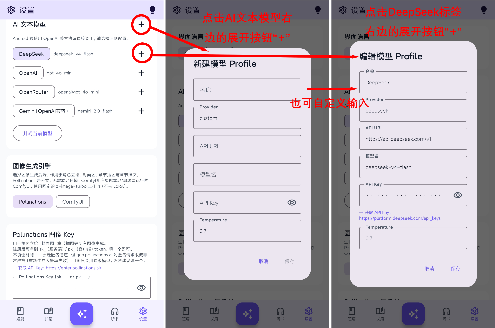

#### 2.3 （可选）配置 Embedding 服务（API）

在**本地知识库（实验性）**区块，点击 **「启用本地知识库」** 启动本地知识库：

- **API Base URL**：Embedding 服务地址（例如阿里云百炼 `https://bailian.console.aliyun.com/cn-beijing?tab=model#/api-key`）
- **API Key**：服务密钥（例如阿里云百炼 `https://dashscope.aliyuncs.com/compatible-mode/v1`）
- **模型名称**：填写你使用的模型 ID（例如阿里云百炼的text-embedding-v3）
- **维度**：默认1024

填写后点击**测试连接**，出现蓝色成功提示则配置正确。

#### 2.4 配置图片生成引擎

在**图片生成引擎**区块选择：

- **Pollinations**：云端免费，[但最好创建密钥](https://enter.pollinations.ai/#keys)，否则默认采用旧版文生图，质量较低
- **ComfyUI**：连接本地局域网 ComfyUI（适合有本地 GPU 的用户，且部署了"./workflows/t2i-lumicreate.json"的工作流并运行通过）
  - 填写局域网 IP，如 `http://192.168.1.100:8188`
  - 点击**测试 ComfyUI 连接**确认可达

> ⚠️ 使用 ComfyUI 时，手机与运行 ComfyUI 的电脑必须在同一 Wi-Fi 网络下。

---

### 3. （**仅用于20章以下项目，建议直接跳过此段看长篇小说项目介绍**）短篇小说：完整创作流程

短篇小说适合创作结构完整、篇幅较短的故事（5–20 章）。

#### 3.1 新建项目

在**短篇小说**页，点击右下角 **「＋ 新建项目」**：

- 填写**项目名称**（必填）、类型、简介
- 点击**创建**，自动进入项目页


#### 3.2 生成大纲

在项目页点击 **「大纲」** 按钮，进入大纲页面。

**AI 生成流程：**

1. 填写**世界观描述**（世界背景、核心设定）
2. 填写**时间线**（故事发生的时间背景）
3. 填写**额外要求**（风格、禁忌内容等，可留空）
4. 选择**章节数量**（拖动滑块）
5. 点击 **「生成大纲」**，等待 AI 流式输出


**大纲格式说明（AI 输出）：**
```
## 世界观
...

## 时间线
...

## 章节大纲
### 章节标题A
情节：...
关键场景：...

### 章节标题B
...
```

#### 3.3 保存大纲

AI 输出完成后，点击 **「保存大纲」**，弹出保存选项：

- 勾选需要覆盖的字段：**世界观**、**时间线**、**章节列表**（已有内容时会提示冲突）
- 点击**确认保存**


#### 3.4 从大纲导入章节

回到项目页，在**章节列表**标题右侧点击 **「从大纲导入」**：

- 弹窗展示从大纲中解析出的章节列表
- 确认后一键创建全部空白章节，顺序与大纲一致


#### 3.5 逐章生成内容

点击章节卡片，进入**章节编辑器**。在编辑器中：

1. 上方**规划区**显示该章的目标、冲突（来自大纲）
2. 点击 **「✨ 生成」** 按钮，AI 自动注入上下文（前章摘要、角色信息、世界观）并生成
3. 生成内容出现在**正文**，可直接编辑修改
4. 满意后复制或直接作为最终稿保存

重复此步骤，逐章完成全文。

---

### 4. 长篇小说：完整创作流程

长篇小说支持**副本（分卷）+ 剧情弧线**的层级结构，适合 20 章以上的连载作品。

#### 4.1 新建项目

在**长篇小说**页，点击 **「＋ 新建长篇」**，流程与短篇相同。

#### 4.2 生成大纲

进入项目 → **「大纲」**，建议在**AI 生成大纲**栏可输入额外要求，也可不输入，世界观和时间线也可不输入，直接点击**生成**按钮，长篇大纲文本生成并额外输出**副本（分卷）结构**。

保存时可选择覆盖：世界观、时间线、角色、**副本与弧线**。

#### 4.3 管理副本与剧情弧线

项目页中间区域显示**副本列表**（可展开/收起）：

- **每个副本**下方列出其所属的剧情弧线
- 点击副本名称旁的 **✏️** 可重命名或编辑描述
- 点击 **「＋ 添加弧线」** 手动新增剧情弧线
- 点击副本旁 **「AI 生成」** 可批量 AI 生成弧线（可指定数量和要求）


#### 4.4 快捷调整副本和弧线顺序

每个副本和每条弧线卡片下端有 **↑↓ 按序号调序** 快捷按钮，点击即可调整在副本内的先后顺序，后续章节序号自动顺延。

#### 4.5 章节生成（插入机制）

长篇章节生成与短篇相同，但额外支持：

- 在当前章节**前**或**后**插入新章节（**章节生成页面**的编辑器上方的**规划**框内的按钮**插入章节**操作）
- 插入后所有后续章节序号自动+1

---

### 5. 角色管理

每个项目有独立的角色库，点击项目页的 **「角色」** 按钮进入。也**可在大纲生成前在此处输入角色信息**，大纲文本中的角色信息会依据这里的角色信息生成。

#### 5.1 从大纲导入角色

点击顶栏右侧 **👤＋（从大纲导入）** 图标：

- 应用自动解析当前大纲中的角色信息
- 勾选需要导入的角色（已存在的默认跳过）
- 点击**导入**，角色信息批量写入角色库

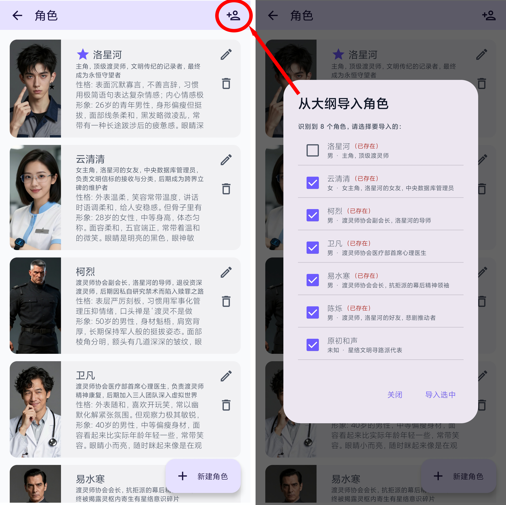

#### 5.2 手动新建 / AI 快速生成角色

点击右下角 **「＋ 新建角色」**，弹出角色编辑框：

- **输入一句描述**（如"一个冷酷的剑客，擅长暗器，曾是朝廷杀手"）后点击 **「AI 生成」**
- AI 自动填写：姓名、性别、身份、性格、背景故事、动机、外貌等全部字段
- 生成时自动参考当前大纲与境界体系，确保与小说设定一致
- 可手动修改任何字段后点击**保存**


#### 5.3 角色头像生成

在角色编辑框中，点击右上角的编辑按钮打开**编辑角色**窗口，在**形象**栏输入信息（往往已由AI生成）， 可选输入立绘画风，点击**「AI 形象」** 由图片引擎根据角色描述生成立绘。

---

### 6. 修炼体系与境界

仙侠/玄幻类作品可使用**修炼体系**功能管理境界层级，进入方式：

- **长篇项目页**：点击顶栏右侧的 🗺️ 图标 → **境界信息**（不能编辑）
- **项目页工具栏**（一行可横向滑动的按钮）：找到 **「修炼」** 按钮 → **修炼体系管理**（可编辑）

#### 6.1 添加境界

在**项目页工具栏**打开**修炼体系管理**，修炼体系页，在顶部输入框填写境界名称与描述，点击 **「添加」**。

可在每个境界下添加子境界（如：炼气期 → 炼气一层、炼气二层……）。


#### 6.2 为角色分配境界

点击顶栏 🗺️ 图标 → 弹出**境界信息对话框** → 切换到**角色境界** Tab：

- 展开每个角色，从列表中点击境界名称即可分配
- 也可同时指定子境界（如"筑基期·中期"）
- 境界信息会自动注入章节生成的上下文中


---

### 7. 章节编辑器

章节编辑器是写作的核心页面，有两个 Tab：

| Tab | 功能 |
|-----|------|
| 最终稿 | 定稿版本，用于导出 |
| 插图 | 为段落锚定 AI 生成插图 | 

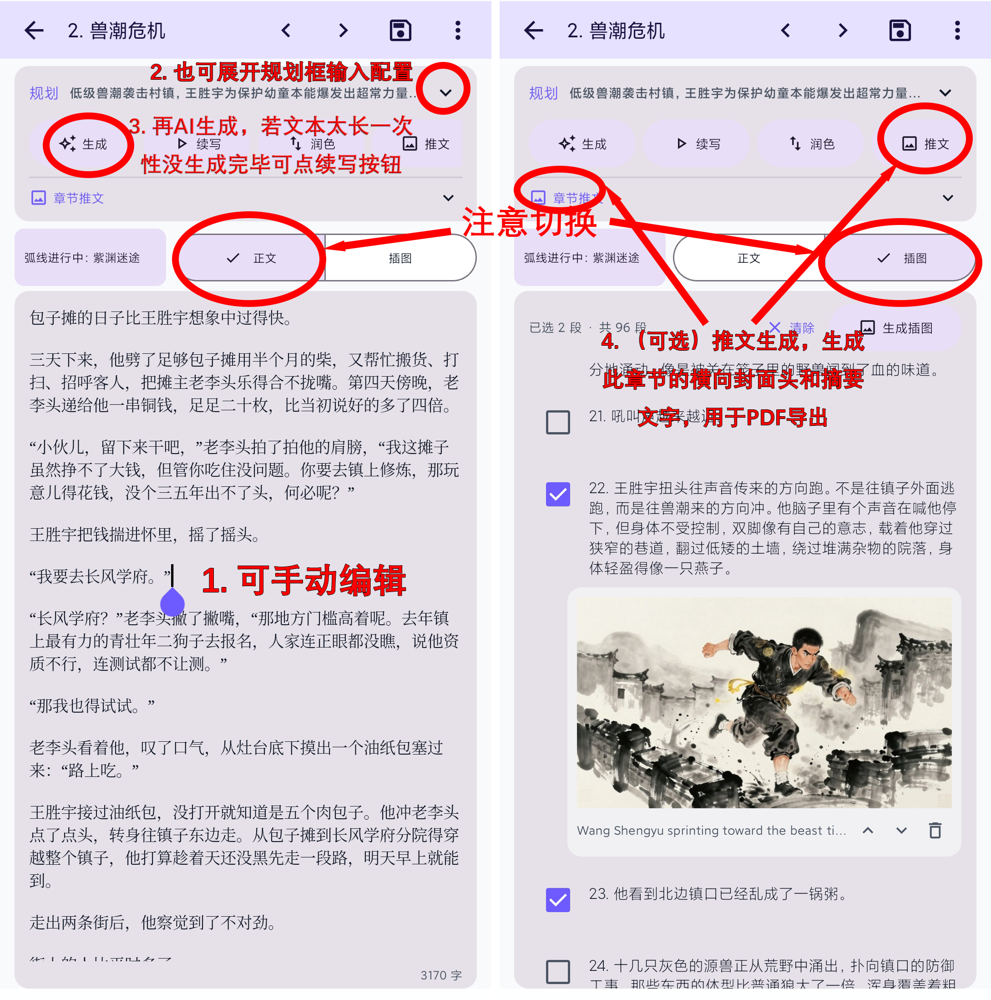

#### 7.1 AI 生成章节

点击 **「✨ 生成本章」**，AI 自动注入：

- 大纲目标与冲突（来自章节规划）
- 前 3 章摘要（越近越详细）
- 所有角色信息（主角尤其详细）
- 世界观与时间线
- 当前境界信息（如有）
- 容器最新值（如启用了"影响章节生成"的容器）
- 设置页的本地知识库的索引片段 + 章节摘要 + 全书梗概（如有）

生成内容实时流式显示在**草稿区**。

#### 7.2 AI 润色 / 改写选段

目前仅在PC端实现，在草稿区**长按并选中**一段文字，点击浮现的 **「改写」** 按钮，AI 对选中段落进行润色重写，结果替换原文。

#### 7.3 插入新章节

在章节生成页面编辑器上方的**规划**框，里面有一行按钮，点击 **插入章节** 可在当前章节前/后插入空白章节，其后所有章节序号自动顺延。

---

### 8. 插图生成

在编辑器切换到**插图 Tab**：

1. 点击任意段落将其**选中**（可随意勾选，可勾选不相邻的段落）
2. 点击 **「🎨 生成插图」** 按钮
3. 在弹出的配置框中设置图片宽高、风格关键词
4. 点击**生成**，图片出现后自动锚定到该段落


---

### 9. 封面与宣传图

在项目页工具栏（短篇/长篇通用）：

- **「封面」** → 管理项目封面图，支持多张轮播，可设为默认封面
- **「批量推文」** → 批量生成各章节的封面头图（已有图片的章节自动跳过）

#### 生成封面

进入封面管理，在底部配置区：

1. 填写**图片模型**（如 `zimage`）
2. 填写**风格描述**（如 "中国水墨，古风，高饱和"）
3. 选择**角色一致性**（可多选角色，将其外貌描述注入 Prompt）
4. 调整**宽高**
5. 点击 **「生成」**

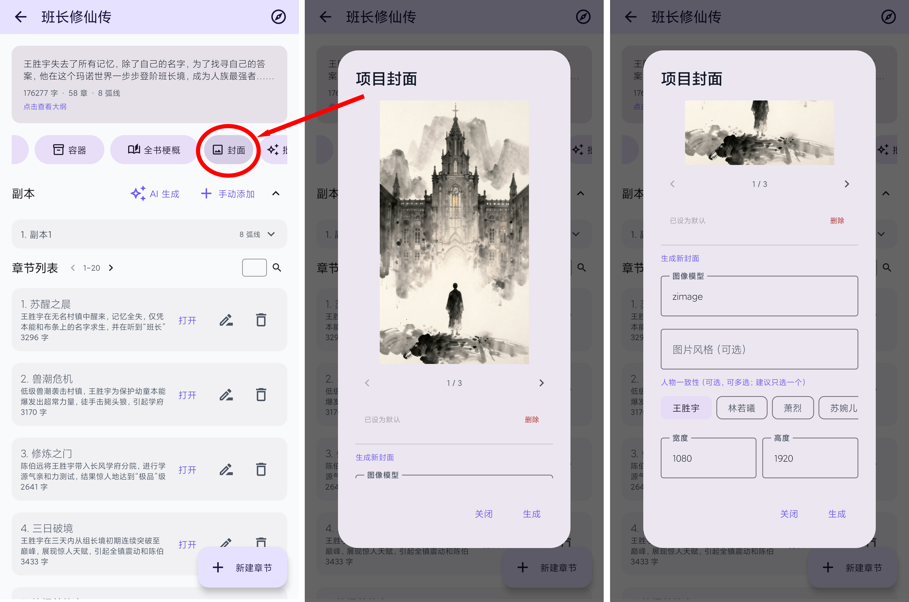

---

### 10. 版本管理

**版本管理**相当于小说项目的 Git 快照，将当前所有内容打包保存。

进入方式：项目页工具栏 → **「版本」**。

#### 10.1 保存版本

点击 **「保存当前版本」**，输入版本备注（如"第一卷完成"）后确认，系统打包全部数据（章节正文/草稿、大纲、角色、插图、弧线、容器等）。

> AI 生成章节前会**自动备份**，无需手动触发。

#### 10.2 回退版本

在版本列表中，点击任意历史版本 → **「回退到此版本」**：

- 系统在回退前先自动保存当前状态（可再次撤销）
- 回退完成后自动清理知识库中失效的向量
- 标记需要重建的章节，支持**仅重建变化章节**的增量重建

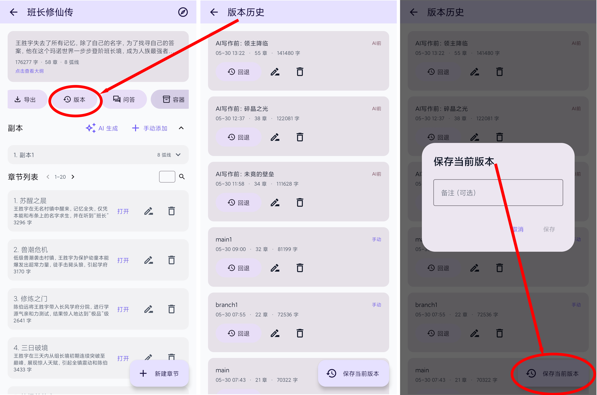

---

### 11. 容器（AI 自演化知识库）

**容器**是 NovelSeek Ultra 独有的功能——随着故事推进自动演化的知识条目，防止前后矛盾。

进入方式：项目页工具栏 → **「容器」**，或章节编辑器顶栏溢出菜单 → **「容器」**。

#### 11.1 新建容器

点击 **「＋ 新建容器」**，选择容器类型：

| 类型 | 说明 |
|------|------|
| 按角色分块 | 每个角色一个条目，追踪角色状态 |
| 按章节分块 | 每章一个条目，追踪情节发展 |
| 不分块 | 全局单一条目，适合追踪物品/设定等 |

#### 11.2 配置容器开关

| 开关 | 效果 |
|------|------|
| 按章更新 | 每次保存最新章时，AI 自动演进容器值 |
| 影响章节生成 | 容器最新值作为软引导注入章节生成 |
| 影响副本生成 | 容器值注入副本/弧线 AI 生成 |


---

### 12. 小说问答

用自然语言向 AI 询问关于当前小说的任何问题。

进入方式：项目页工具栏 → **「问答」**，或章节编辑器顶栏溢出菜单 → **「问答」**。

**示例问题：**
- "陈风现在是什么境界？"
- "A 和 B 之间发生了什么事？"
- "目前哪些伏笔还没有被收回？"
- "第五章之后发生了什么大事？"

AI 基于当前版本的角色数据、境界信息、章节摘要等混合检索作答，并标注信息来源的章节编号，对话按项目保存，支持追问。

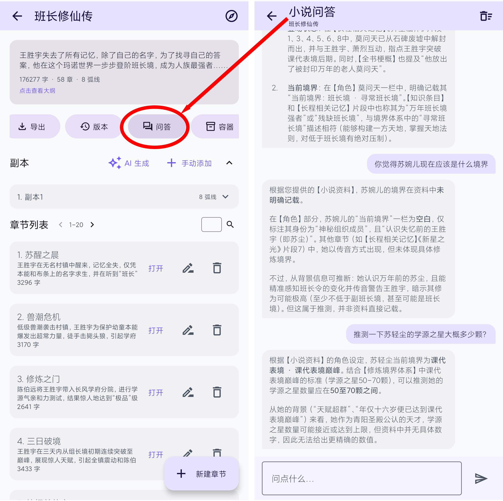

---

### 13. 智能体（Agent）

**智能体**是 NovelSeek Ultra 的旗舰功能——一个能像人一样操作全软件的自主 AI 助手。

点击底部导航栏**正中央**的 🤖 大按钮进入。

#### 13.1 一句话完成整本小说

在输入框输入你的需求，例如：

> "帮我写一部三卷十五章的东方玄幻小说，主角是剑修，带点悲剧色彩。"

智能体将自动执行：
建项目 → 设定境界体系 → 生成世界观 → 生成大纲 → 批量导入角色并生成立绘 → 生成封面 → 规划副本与弧线 → 逐章生成正文

整个过程在**执行流**中实时可见，每一步都有说明。

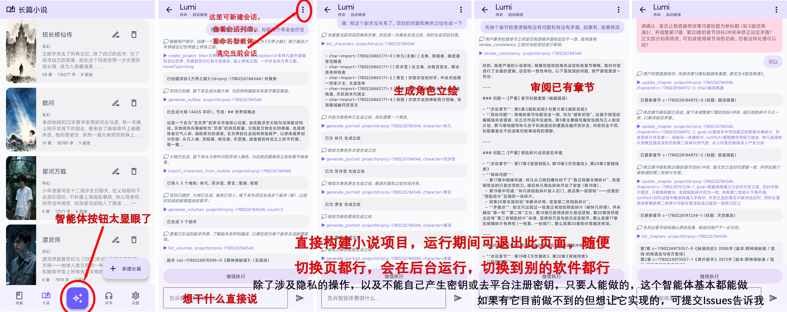

#### 13.2 控制执行

- **停止**：随时中断当前任务
- **继续**：中断后可恢复执行
- **插话**：运行中可发送新消息调整方向
- **反问**：智能体需要你决策时会暂停并提问

#### 13.3 半自主模式

敏感操作（如删除章节、回退版本）默认需要逐步确认。可在对话中说 **「始终允许」** 或锁定项目后开启**自动继续**，让智能体全程自主执行。

#### 13.4 后台运行

切到后台或息屏后，智能体继续运行（前台服务）。通知栏显示进度，可一键停止。

#### 13.5 多会话管理

点击顶部会话名称，可新建、重命名、切换或删除会话，各会话独立保存历史。

---

### 14. 听书

在底部导航栏点击 🎧 **听书** 进入。

1. 选择项目（短篇或长篇均可）
2. 选择要朗读的章节
3. 在顶部选择**音色**（多种中文神经语音）和**语速**
4. 点击 ▶ 播放

**功能特点：**
- 使用微软 Edge 免费神经语音，无需付费
- 分段流式合成，边生成边播放，衔接流畅
- 进度滑块可拖动跳段
- 章末自动播放下一章
- 离开页面自动保存进度，重进后从断点恢复

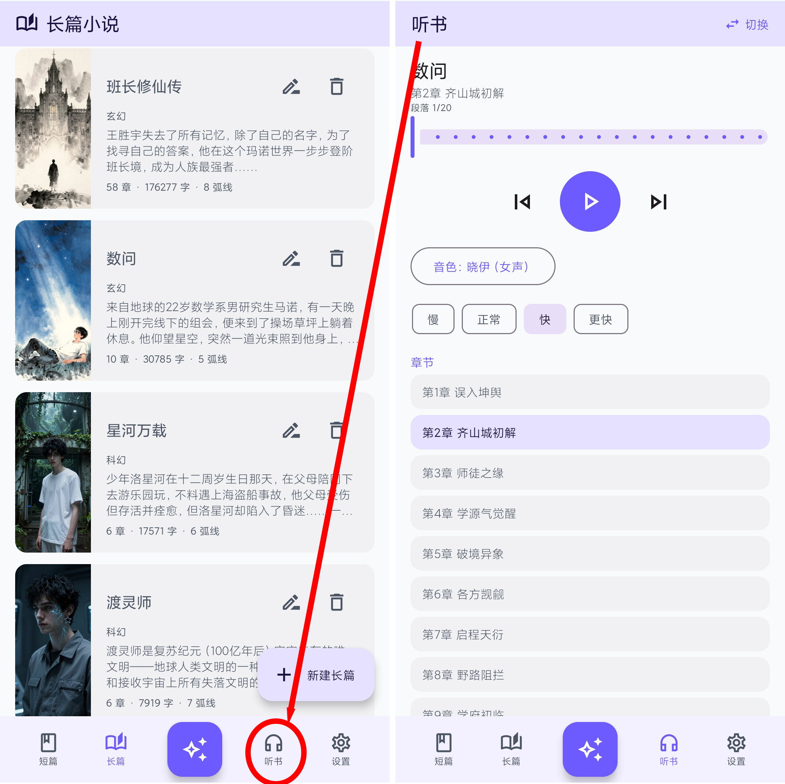

---

### 15. 导出

项目页工具栏 → **「导出」**，或章节编辑器内直接导出。

#### 支持格式

| 格式 | 特点 |
|------|------|
| TXT | 纯文本，兼容性最强 |
| Markdown | 保留标题层级结构 |
| PDF | 富文本排版，支持封面、目录、插图、章节推文图 |

#### PDF 导出选项

- ☑ 包含封面图
- ☑ 包含目录（可点击跳转）
- ☑ 包含章节头图（推文图）
- ☑ 包含段落插图
- ☑ 优先使用最终稿（否则用草稿）

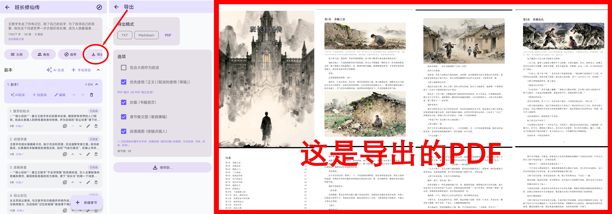

---

### 16. 数据备份与恢复

设置页 → **「数据备份」** 区块。

#### 16.1 导出备份

点击 **「导出备份」**，系统生成包含全部项目数据的 JSON 文件（时间戳命名），保存到你指定的位置。

备份内容包括：项目信息、章节正文与草稿、插图、大纲/世界观/时间线、角色、副本与弧线、容器、摘要/实体、小说问答记录。

> ⚠️ API 密钥存储在 Android Keystore 中，**不会**出现在备份文件里，需要在新设备手动重新配置。

#### 16.2 导入备份（换机恢复）

点击 **「导入备份」** → 选择备份 JSON 文件 → 确认导入，所有项目和内容恢复到新设备。

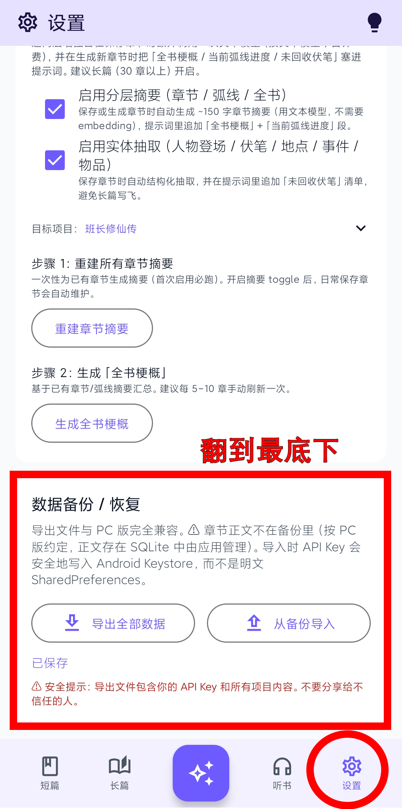

---
